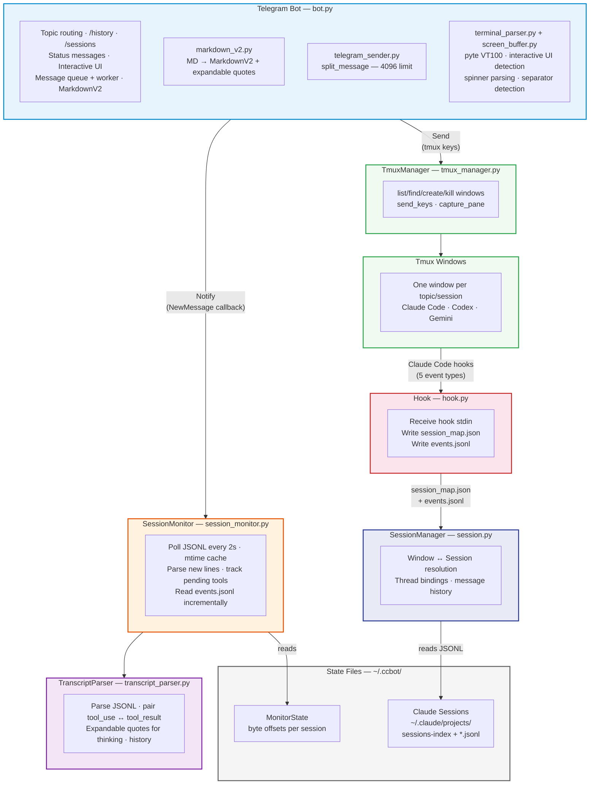

# System Architecture

## Module Inventory

### Provider modules (`providers/`)

| Module        | Description                                                                              |
| ------------- | ---------------------------------------------------------------------------------------- |
| `base.py`     | AgentProvider protocol, ProviderCapabilities, event types                                |
| `registry.py` | ProviderRegistry (name→factory map, singleton cache)                                     |
| `_jsonl.py`   | Shared JSONL parsing base class for Codex + Gemini                                       |
| `claude.py`   | ClaudeProvider (hook, resume, continue, JSONL transcripts)                               |
| `codex.py`    | CodexProvider (resume, continue, JSONL transcripts, no hook)                             |
| `gemini.py`   | GeminiProvider (resume, continue, whole-file JSON transcripts, no hook)                  |
| `__init__.py` | `get_provider_for_window()`, `detect_provider_from_command()`, `get_provider()` fallback |

### Core modules (`src/ccbot/`)

| Module             | Description                                                          |
| ------------------ | -------------------------------------------------------------------- |
| `cli.py`           | Click-based CLI entry point (run subcommand + all bot-config flags)  |
| `config.py`        | Application configuration singleton (env vars, .env files, defaults) |
| `doctor_cmd.py`    | `ccbot doctor [--fix]` — validate setup without bot token            |
| `status_cmd.py`    | `ccbot status` — show running state without bot token                |
| `screen_buffer.py` | pyte VT100 screen buffer (ANSI→clean lines, separator detection)     |
| `cc_commands.py`   | CC command discovery (skills, custom commands) + menu registration   |
| `screenshot.py`    | Terminal text → PNG rendering (ANSI color, font fallback)            |
| `main.py`          | Application entry point (Click dispatcher, run_bot bootstrap)        |
| `utils.py`         | Shared utilities (ccbot_dir, tmux_session_name, atomic_write_json)   |

### Handler modules (`handlers/`)

| Module                     | Description                                                        |
| -------------------------- | ------------------------------------------------------------------ |
| `text_handler.py`          | Text message routing (UI guards → unbound → dead → forward)        |
| `message_sender.py`        | safe_reply/safe_edit/safe_send + rate_limit_send                   |
| `message_queue.py`         | Per-user queue + worker (merge, status dedup)                      |
| `status_polling.py`        | Background status line polling (1s interval, auto-close logic)     |
| `response_builder.py`      | Response pagination and formatting                                 |
| `interactive_ui.py`        | AskUserQuestion / ExitPlanMode / Permission UI rendering           |
| `interactive_callbacks.py` | Callbacks for interactive UI (arrow keys, enter, esc)              |
| `directory_browser.py`     | Directory selection UI for new topics                              |
| `directory_callbacks.py`   | Callbacks for directory browser (navigate, confirm, provider pick) |
| `window_callbacks.py`      | Window picker callbacks (bind, new, cancel)                        |
| `recovery_callbacks.py`    | Dead window recovery callbacks (fresh, continue, resume)           |
| `screenshot_callbacks.py`  | Screenshot refresh, Esc, quick-key callbacks                       |
| `history.py`               | Message history display with pagination                            |
| `history_callbacks.py`     | History pagination callbacks (prev/next)                           |
| `sessions_dashboard.py`    | /sessions command: active session overview + kill                  |
| `resume_command.py`        | /resume command: scan past sessions, paginated picker              |
| `upgrade.py`               | /upgrade command: uv tool upgrade + process restart                |
| `file_handler.py`          | Photo/document handler (save to .ccbot-uploads/, notify agent)     |
| `command_history.py`       | Per-user/per-topic in-memory command recall (max 20)               |
| `topic_emoji.py`           | Topic name emoji updates (active/idle/done/dead), debounced        |
| `hook_events.py`           | Hook event dispatcher (Notification, Stop, SubagentStart/Stop)     |
| `cleanup.py`               | Centralized topic state cleanup on close/delete                    |
| `callback_data.py`         | CB\_\* callback data constants for inline keyboard routing         |
| `callback_helpers.py`      | Shared helpers (user_owns_window, get_thread_id)                   |
| `user_state.py`            | context.user_data string key constants                             |

### State files (`~/.ccbot/` or `$CCBOT_DIR/`)

| File                 | Description                                                    |
| -------------------- | -------------------------------------------------------------- |
| `state.json`         | Thread bindings + window states + display names + read offsets |
| `session_map.json`   | Hook-generated window_id→session mapping                       |
| `events.jsonl`       | Append-only hook event log (all 5 event types)                 |
| `monitor_state.json` | Poll progress (byte offset) per JSONL file                     |

## Key Design Decisions

- **Topic-centric** — Each Telegram topic binds to one tmux window. No centralized session list; topics _are_ the session list.
- **Window ID-centric** — All internal state keyed by tmux window ID (e.g. `@0`, `@12`), not window names. Window IDs are guaranteed unique within a tmux server session. Window names are kept as display names via `window_display_names` map. Same directory can have multiple windows.
- **Hook-based event system** — Claude Code hooks (SessionStart, Notification, Stop, SubagentStart, SubagentStop) write to `session_map.json` and `events.jsonl`. SessionMonitor reads both: session_map for session tracking, events.jsonl for instant event dispatch (interactive UI, done detection, subagent status). Terminal scraping remains as fallback.
- **Tool use ↔ tool result pairing** — `tool_use_id` tracked across poll cycles; tool result edits the original tool_use Telegram message in-place.
- **MarkdownV2 with fallback** — All messages go through `safe_reply`/`safe_edit`/`safe_send` which convert via `telegramify-markdown` and fall back to plain text on parse failure.
- **No truncation at parse layer** — Full content preserved; splitting at send layer respects Telegram's 4096 char limit with expandable quote atomicity.
- Only sessions registered in `session_map.json` (via hook) are monitored.
- Notifications delivered to users via thread bindings (topic → window_id → session).
- **Startup re-resolution** — Window IDs reset on tmux server restart. On startup, `resolve_stale_ids()` matches persisted display names against live windows to re-map IDs. Old state.json files keyed by window name are auto-migrated.
- **Per-window provider** — All CLI-specific behavior (launch args, transcript parsing, terminal status, command discovery) is delegated to an `AgentProvider` protocol. Providers declare capabilities (`ProviderCapabilities`) that gate UX features per-window: hook checks, resume/continue buttons, and command registration. Each window stores its `provider_name` in `WindowState`; `get_provider_for_window(window_id)` resolves the correct provider instance, falling back to the config default. Externally created windows are auto-detected via `detect_provider_from_command(pane_current_command)`. The global `get_provider()` singleton remains for CLI commands (`doctor`, `status`) that lack window context.
