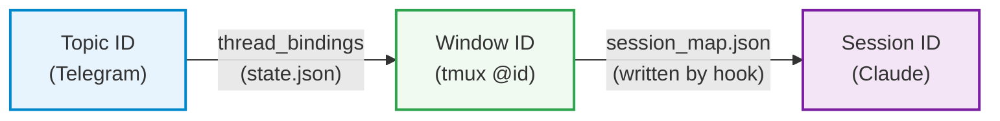

# Topic-Only Architecture

The bot operates exclusively in Telegram Forum (topics) mode. There is **no** `active_sessions` mapping, **no** `/list` command, **no** General topic routing, and **no** backward-compatibility logic for older non-topic modes. Every code path assumes named topics.

## 1 Topic = 1 Window = 1 Session



Window IDs (e.g. `@0`, `@12`) are guaranteed unique within a tmux server session. Window names are stored separately as display names (`window_display_names` map).

## Mapping 1: Topic → Window ID (thread_bindings)

```python
# session.py: SessionManager
thread_bindings: dict[int, dict[int, str]]  # user_id → {thread_id → window_id}
window_display_names: dict[str, str]        # window_id → window_name (for display)
```

- Storage: memory + `state.json`
- Written when: user creates a new session via the directory browser in a topic
- Purpose: route user messages to the correct tmux window

## Mapping 2: Window ID → Session (session_map.json)

```python
# session_map.json (key format: "tmux_session:window_id")
{
  "ccbot:@0": {"session_id": "uuid-xxx", "cwd": "/path/to/project", "window_name": "project", "provider_name": "claude", "transcript_path": "..."},
  "ccbot:@5": {"session_id": "uuid-yyy", "cwd": "/path/to/project", "window_name": "project-2", "provider_name": "codex", "transcript_path": "..."}
}
```

- Storage: `session_map.json`
- Written when: Claude Code's `SessionStart` hook fires (always sets `provider_name: "claude"`; other providers have no hook). All 5 hook events also append to `events.jsonl` for instant dispatch.
- Property: one window maps to one session; session_id changes after `/clear`
- Purpose: SessionMonitor reads session_map to decide which sessions to watch, and reads events.jsonl for instant event notifications (interactive UI, done detection, subagent status)

## Message Flows

**Outbound** (user → Claude):

```
User sends "hello" in topic (thread_id=42)
  → thread_bindings[user_id][42] → "@0"
  → send_to_window("@0", "hello")   # resolves via find_window_by_id
```

**Inbound** (Claude → user):

```
SessionMonitor reads new message (session_id = "uuid-xxx")
  → Iterate thread_bindings, find (user, thread) whose window_id maps to this session
  → Deliver message to user in the correct topic (thread_id)
```

**New topic flow**: First message in an unbound topic → directory browser → select directory → select provider → create window with chosen provider → bind topic → forward pending message.

**Topic lifecycle**: Closing/deleting a topic auto-kills the associated tmux window and unbinds the thread. Stale bindings (window deleted externally) are cleaned up by the status polling loop.

## Session Lifecycle

**Startup cleanup**: On bot startup, all tracked sessions not present in session_map are cleaned up, preventing monitoring of closed sessions.

**Runtime change detection**: Each polling cycle checks for session_map changes:

- Window's session_id changed (e.g., after `/clear`) → clean up old session
- Window deleted → clean up corresponding session
